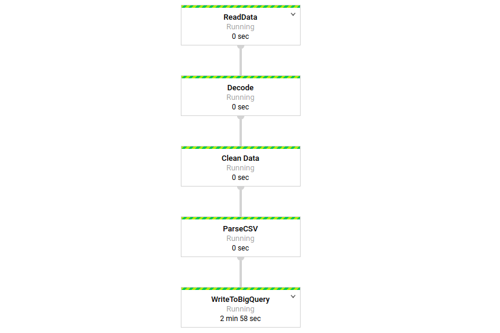

# helbiz-data-science-test

### Tech Stack:
******
***Programming Language:*** `Python 3.6.8`

***IDE:*** `PyCharm Community Edition 2019.3.1`

***Cloud Service:*** `Google Cloud Platform`

***Verison Control:*** `Git`
******
 

### Data Collection and Proccessing
******
***`requests` library used to send requests to the urls***

***`Apache Beam` used to create data streaming pipeline. Steps: 1. Read data stream, 2.Decode, 3. Clean data, 4.Parse CSV, 5.Write cleaned data into `GCP BigQuery`.*** 
 
******
 

### Cloud Infrastructure
******
***Cloud Service***
 
`Google Cloud Platform`

***Products Used***

`GCP Storage` to store scripts

`GCP Pub/Sub` to create data stream

`GCP Functions` to run the [script](main.py) for publishing data into GCP Pub/Sub.

`GCP Scheduler` to trigger GCP Function in every 15 minutes.

`GCP Dataflow` to process data stream and to write results into GCP BigQuery

`GCP BigQuery` to store data that comes from [streaming pipeline](pipeline_stream.py)

`GCP App Engine` to deploy [API](https://real-time-gbfs-feeds.appspot.com/) as a web service.
******
 

### Algorithms for Hot Sposts
******
***I implemented two different algorithms for creating hexagon bins. [First]() one uses mathematical formula to create array of hexagonal bins given bin width. [Second]() one creates hexagonal bins by using Matplotlib's PolyCollection class.***
******